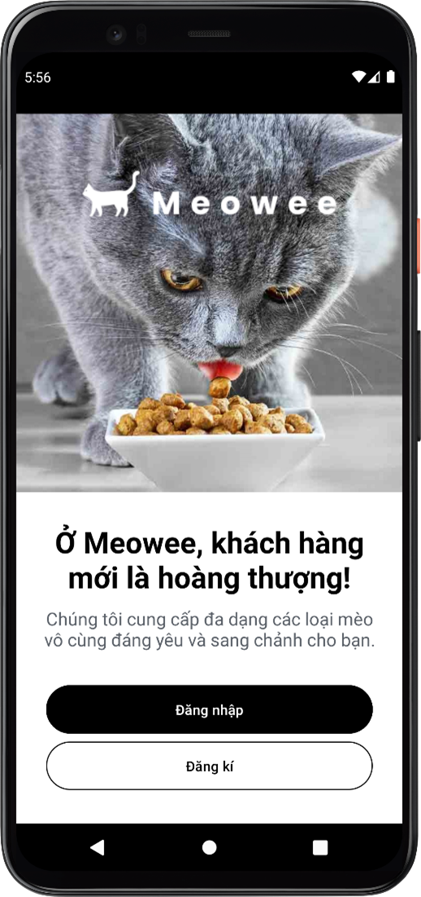
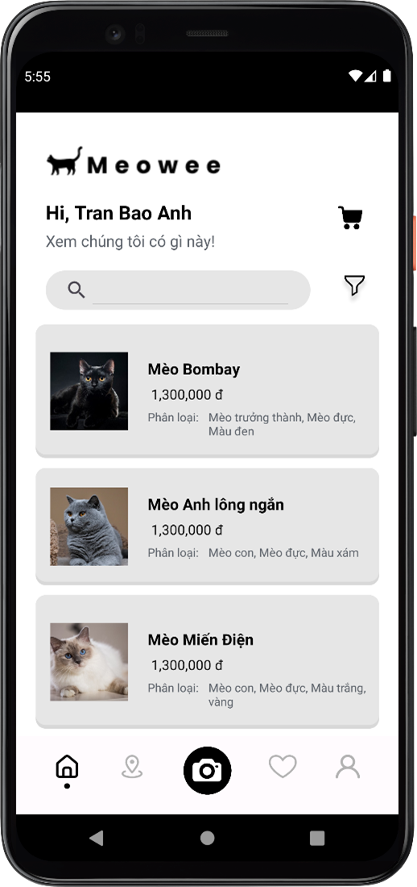
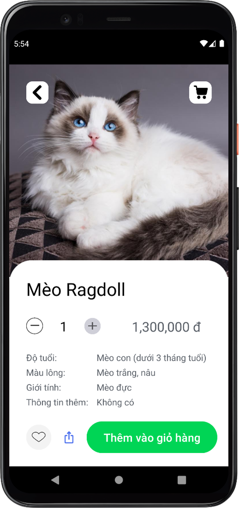
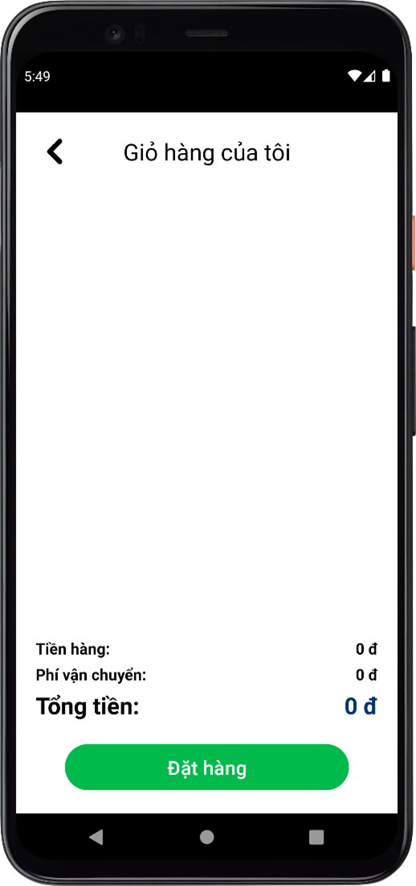
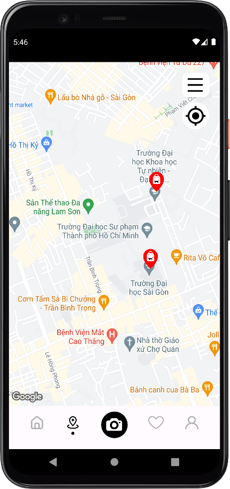

# Meowee - Cat Store Online App
<!-- 

  

 -->

**Content:**
<ul style="list-style-type: none">
    <li><a href="#about">About us</a></li>
    <li><a href="#set_up">Setup</a></li>
    <li><a href="#demo">Demo</a></li>
</ul>

<h5 id="about"></h5>

## 1. About us
We will introduce briefly about our project:

+ This is our project for the Mobile Development course at HCMUS.
+ Our application is a cat online store that have several features like product catalog, shopping cart, customers account, smart product search, cat classification, ...

  
<!--  -->

### Contributors:

|   Student ID   |            Name               | Profile 
|----------------|-------------------------------|----------------------------
|    20120250    |Tran Bao Anh | [@tranbaoanh27](https://github.com/tranbaoanh27)            
|    20120476    |Nguyen Trong Hieu | [@NguyenHiu](https://github.com/NguyenHiu)
|    20120607    |Le Huu Trong | [@lhtrong](https://github.com/lhtrong)           

<h5 id="set_up"></h5>

## 2. Setup

We build this app with `Android Studio` and `Java` language.
* **Database**: `Firebase`.
* **OS**: Windows 10/11.

<h5 id="demo"></h5>

## 3. Demo
First, make sure that you have an account (you can register an account or recover your password by clicking the buttons below). 

After logging in, this is the home page of our application.

This is an overview of the basic functionality of the application:

## Final Notes

**Thanks for going through this Repository! Have a nice day.**

Got any queries? Feel free to contact us via <a href = "mailto: letrong2307@gmail.com">E-mail</a>.
